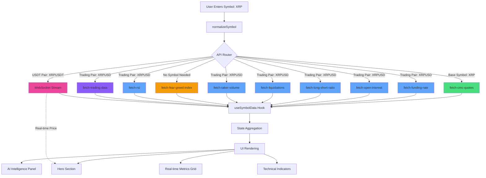

# Symbol Details Page - Technical Documentation

**Location**: `src/pages/SymbolDetails.tsx`  
**Primary Hook**: `src/hooks/useSymbolData.ts`  
**Last Updated**: 2025-11-18

---

## 1. Page Overview

The Symbol Details page displays comprehensive cryptocurrency data for a single trading pair. It aggregates data from multiple sources including CoinMarketCap (market data), Coinglass (derivatives metrics), and real-time WebSocket streams.

### Key Features
- **Real-time price updates** via WebSocket
- **Comprehensive market metrics** (rank, price, volume, market cap, supply)
- **Derivatives data** (funding rate, open interest, long/short ratio, liquidations)
- **Technical indicators** (RSI, taker volume)
- **AI trading signals** with confidence and reasoning
- **Symbol search** functionality for quick navigation

### Update Strategy
- **WebSocket**: Real-time price updates (sub-second)
- **Polling**: Main data refresh every 30 seconds
- **Caching**: API responses cached 5-15 minutes server-side

---

## 2. Input Data Processing

### Symbol Normalization Flow

```typescript
// User Input Examples: "BTC", "ETH", "XRP", "BTCUSD", "ETHUSDT"
// Step 1: Normalize to base symbol
normalizeSymbol("BTCUSD")   → "BTC"
normalizeSymbol("ETHUSDT")  → "ETH"
normalizeSymbol("XRP")      → "XRP"

// Step 2: Add USD suffix for APIs
addUsdSuffix("BTC")  → "BTCUSD"
addUsdSuffix("ETH")  → "ETHUSD"
```

### Utility Functions
**File**: `src/lib/symbolUtils.ts`

| Function | Purpose | Example |
|----------|---------|---------|
| `normalizeSymbol(symbol)` | Removes USD/USDT suffix | "BTCUSD" → "BTC" |
| `addUsdSuffix(symbol)` | Adds USD suffix | "BTC" → "BTCUSD" |

### Critical Rule
- **CoinMarketCap APIs**: Use base symbol only (e.g., "BTC", "ETH", "XRP")
- **Coinglass APIs**: Use trading pair (e.g., "BTCUSD", "ETHUSD", "XRPUSD")
- **WebSocket**: Use trading pair with USDT suffix (e.g., "BTCUSDT", "ETHUSDT")

---

## 3. API Endpoints Reference

### 3.1 CoinMarketCap - Market Data

**Endpoint**: `fetch-cmc-quotes`  
**Input Format**: Base symbol (e.g., "BTC")  
**Cache Duration**: 5 minutes  
**Refresh Interval**: 30 seconds

#### Request
```typescript
supabase.functions.invoke("fetch-cmc-quotes", { 
  body: { symbol: "BTC" } // Base symbol only
})
```

#### Response Structure
```typescript
{
  data: {
    data: {
      "BTC": {
        cmc_rank: 1,
        circulating_supply: 19950440,
        quote: {
          USD: {
            price: 93382.22,
            percent_change_24h: 1.45,
            volume_24h: 115959043748.35,
            market_cap: 1863016567518.32
          }
        }
      }
    }
  }
}
```

#### Fields Used
- `data.data[symbol].cmc_rank` → Rank
- `data.data[symbol].circulating_supply` → Circulating Supply
- `data.data[symbol].quote.USD.price` → Current Price
- `data.data[symbol].quote.USD.percent_change_24h` → 24h Change
- `data.data[symbol].quote.USD.volume_24h` → 24h Volume
- `data.data[symbol].quote.USD.market_cap` → Market Cap

#### Error Handling
- Missing data: Returns `null` for all fields
- Invalid symbol: Returns empty data object
- API error: Falls back to cached data or displays "--"

---

### 3.2 Coinglass - Funding Rate

**Endpoint**: `fetch-funding-rate`  
**Input Format**: Trading pair (e.g., "BTCUSD")  
**Cache Duration**: 15 minutes  
**Refresh Interval**: 30 seconds

#### Request
```typescript
supabase.functions.invoke("fetch-funding-rate", { 
  body: { symbol: "BTCUSD" } // Trading pair required
})
```

#### Response Structure
```typescript
{
  current: {
    rate: "0.0123%",
    rateValue: 0.000123,
    sentiment: "POSITIVE" | "NEGATIVE" | "NEUTRAL" | "UNAVAILABLE",
    nextFunding: "2025-11-19T00:00:00Z"
  },
  history: [
    { timestamp: "2025-11-18T16:00:00Z", rate: 0.000123 }
  ],
  message?: "Derivatives data not available for this symbol",
  unavailable?: true
}
```

#### Fields Used
- `current.rate` → Funding Rate display
- `current.rateValue` → Numeric value for calculations
- `current.sentiment` → Trend indicator

#### Error Handling
- Unavailable data: Shows "N/A" with unavailable message
- Invalid symbol: Returns `unavailable: true` flag

---

### 3.3 Coinglass - Open Interest

**Endpoint**: `fetch-open-interest`  
**Input Format**: Trading pair (e.g., "ETHUSD")  
**Cache Duration**: 15 minutes  
**Refresh Interval**: 30 seconds

#### Request
```typescript
supabase.functions.invoke("fetch-open-interest", { 
  body: { symbol: "ETHUSD" }
})
```

#### Response Structure
```typescript
{
  total: {
    value: "$2.5B",
    valueRaw: 2500000000,
    change24h: "+5.67%",
    sentiment: "BULLISH" | "BEARISH" | "NEUTRAL" | "UNAVAILABLE"
  },
  byExchange: [
    { name: "Binance", value: 1200000000 }
  ],
  history: [
    { timestamp: "2025-11-18T12:00:00Z", value: 2450000000 }
  ],
  message?: "Derivatives data not available",
  unavailable?: true
}
```

#### Fields Used
- `total.valueRaw` → Open Interest amount
- `total.change24h` → 24h change percentage

#### Error Handling
- Unavailable: Shows "N/A" with message
- Zero value: Displays "--"

---

### 3.4 Coinglass - Long/Short Ratio

**Endpoint**: `fetch-long-short-ratio`  
**Input Format**: Trading pair (e.g., "XRPUSD")  
**Cache Duration**: 15 minutes  
**Refresh Interval**: 30 seconds

#### Request
```typescript
supabase.functions.invoke("fetch-long-short-ratio", { 
  body: { symbol: "XRPUSD" }
})
```

#### Response Structure
```typescript
{
  symbol: "XRPUSD",
  timestamp: "2025-11-18T19:31:00Z",
  ratio: "0.703",
  long_percent: "70.25",
  short_percent: "29.75",
  sentiment: "BULLISH" | "BEARISH" | "NEUTRAL",
  exchanges: [
    { name: "Binance", long: "70.25", short: "29.75" }
  ],
  historical: [
    { timestamp: "2025-11-18T16:00:00Z", ratio: "0.750" }
  ]
}
```

#### Fields Used
- `ratio` → Long/Short Ratio numeric value
- `sentiment` → Trend indicator

#### Error Handling
- No data: Returns neutral sentiment with "--" display

---

### 3.5 Coinglass - Liquidations

**Endpoint**: `fetch-liquidations`  
**Input Format**: Trading pair (e.g., "BTCUSD")  
**Cache Duration**: 15 minutes  
**Refresh Interval**: 30 seconds

#### Request
```typescript
supabase.functions.invoke("fetch-liquidations", { 
  body: { symbol: "BTCUSD" }
})
```

#### Response Structure
```typescript
{
  last24h: {
    total: "66.4M",
    totalLongs: "40.1M",
    totalShorts: "26.3M",
    ratio: "60.3% longs",
    longShortRatio: "1.52",
    majorEvents: []
  },
  recentLiquidations: [
    { 
      time: 1763481600000, 
      longLiq: 1246161.52, 
      shortLiq: 979018.24 
    }
  ],
  heatmap: { levels: [] }
}
```

#### Fields Used
- `last24h.total` → Total 24h liquidations

#### Error Handling
- No data: Displays "--" or "0.00"

---

### 3.6 Coinglass - Taker Volume

**Endpoint**: `fetch-taker-volume`  
**Input Format**: Trading pair (e.g., "ETHUSD")  
**Cache Duration**: 5 minutes  
**Refresh Interval**: 30 seconds

#### Request
```typescript
supabase.functions.invoke("fetch-taker-volume", { 
  body: { symbol: "ETHUSD" }
})
```

#### Response Structure
```typescript
{
  symbol: "ETHUSD",
  exchanges: [],
  buyRatio: 50,
  sellRatio: 50,
  sentiment: "BALANCED" | "BUYING" | "SELLING" | "STRONG BUYING" | "STRONG SELLING",
  timestamp: 1763494270116,
  isMockData: false
}
```

#### Fields Used
- `buyRatio` → Taker Buy Volume percentage
- `sellRatio` → Taker Sell Volume percentage

#### Error Handling
- Empty exchanges: Falls back to 50/50 split
- Mock data flag indicates fallback data

---

### 3.7 Fear & Greed Index

**Endpoint**: `fetch-fear-greed-index`  
**Input Format**: None (market-wide metric)  
**Cache Duration**: 15 minutes  
**Refresh Interval**: 30 seconds

#### Request
```typescript
supabase.functions.invoke("fetch-fear-greed-index")
```

#### Response Structure
```typescript
{
  value: 50,
  valueClassification: "Neutral" | "Fear" | "Greed" | "Extreme Fear" | "Extreme Greed",
  timestamp: "2025-11-18T19:31:39.674Z",
  isMockData: true,
  unavailable?: true,
  change24h: 0,
  message?: "Fear & Greed Index temporarily unavailable"
}
```

#### Fields Used
- `value` → Index value (0-100)
- `valueClassification` → Sentiment label

#### Error Handling
- Unavailable: Returns mock data with value 50 (Neutral)
- Shows "temporarily unavailable" message

---

### 3.8 Coinglass - RSI

**Endpoint**: `fetch-rsi`  
**Input Format**: Trading pair (e.g., "ETHUSD")  
**Cache Duration**: 15 minutes  
**Refresh Interval**: 30 seconds

#### Request
```typescript
supabase.functions.invoke("fetch-rsi", { 
  body: { symbol: "ETHUSD" }
})
```

#### Response Structure
```typescript
{
  symbol: "ETHUSD",
  rsi14: 50,
  allPeriods: [],
  signal: "NEUTRAL" | "OVERBOUGHT" | "OVERSOLD" | "BULLISH" | "BEARISH",
  timestamp: 1763494270123,
  isMockData: false
}
```

#### Fields Used
- `rsi14` → RSI-14 value (0-100)
- `signal` → Trend indicator

#### Error Handling
- No data: Returns neutral signal with RSI 50
- Empty periods array indicates limited data

---

### 3.9 AI Trading Decision

**Endpoint**: `fetch-trading-data`  
**Input Format**: Trading pair (e.g., "BTCUSD")  
**Cache Duration**: None (real-time analysis)  
**Refresh Interval**: 30 seconds

#### Request
```typescript
supabase.functions.invoke("fetch-trading-data", { 
  body: { symbol: "BTCUSD" }
})
```

#### Response Structure (Accumulating Phase)
```typescript
{
  status: "accumulating",
  message: "Collecting price data for BTCUSD. 0 of 15 minutes collected.",
  progress: 0,
  minutesCollected: 0,
  minutesRequired: 15
}
```

#### Response Structure (Ready Phase)
```typescript
{
  decision: "BUY" | "SELL" | "HOLD",
  confidence: 85,
  reasoning: {
    trend_analysis: "...",
    volume_analysis: "...",
    coinglass_analysis: "...",
    liquidity_analysis: "...",
    entry_trigger_analysis: "..."
  }
}
```

#### Fields Used
- `decision` → Trading decision (BUY/SELL/HOLD)
- `confidence` → Confidence percentage (0-100)
- `reasoning` → Detailed analysis object

#### Error Handling
- Accumulating: Shows progress message
- No data: Displays "Analyzing..." state

---

### 3.10 WebSocket - Real-time Price Stream

**Source**: `useRealtimePriceStream` hook  
**Input Format**: Trading pair with USDT suffix (e.g., "BTCUSDT")  
**Update Frequency**: Real-time (sub-second)

#### Connection
```typescript
const { priceData } = useRealtimePriceStream("BTCUSDT");
```

#### Data Structure
```typescript
{
  price: 93409.43,
  symbol: "BTCUSDT",
  timestamp: 1763494272310
}
```

#### Fields Used
- `price` → Current price (overrides CMC price)

#### Error Handling
- Connection lost: Falls back to last known price
- Reconnection: Automatic with exponential backoff

---

## 4. UI Component Data Mapping

### Hero Section

| UI Element | Data Field | API Source | Format | Refresh |
|------------|-----------|------------|--------|---------|
| **CMC Rank** | `data.rank` | fetch-cmc-quotes | `#123` | 30s |
| **Live Price** | `data.currentPrice` | WebSocket (fallback: CMC) | `$93,409.43` | Real-time |
| **24h Change** | `data.priceChange24h` | fetch-cmc-quotes | `+1.45%` (colored) | 30s |
| **24h Volume** | `data.volume24h` | fetch-cmc-quotes | `$115.96B` | 30s |
| **Market Cap** | `data.marketCap` | fetch-cmc-quotes | `$1.86T` | 30s |
| **Circulating Supply** | `data.circulatingSupply` | fetch-cmc-quotes | `19.95M` | 30s |

**Color Coding**:
- Positive change: `text-success` (green)
- Negative change: `text-destructive` (red)
- Neutral: `text-foreground`

---

### AI Intelligence Panel

| UI Element | Data Field | API Source | Format | Refresh |
|------------|-----------|------------|--------|---------|
| **Decision Badge** | `data.aiDecision` | fetch-trading-data | BUY/SELL/HOLD | 30s |
| **Confidence** | `data.aiConfidence` | fetch-trading-data | `85%` | 30s |
| **Fear & Greed** | `data.fearGreedIndex` | fetch-fear-greed-index | `50 (Neutral)` | 30s |
| **Reasoning** | `data.aiReasoning` | fetch-trading-data | JSON object | 30s |

**Badge Colors**:
- BUY: `bg-success text-success-foreground`
- SELL: `bg-destructive text-destructive-foreground`
- HOLD: `bg-muted text-muted-foreground`

---

### Real-time Metrics Grid

| UI Element | Data Field | API Source | Trend Display | Refresh |
|------------|-----------|------------|--------------|---------|
| **Funding Rate** | `data.fundingRate`, `data.fundingRateTrend` | fetch-funding-rate | Up/Down/Neutral icon | 30s |
| **Open Interest** | `data.openInterest`, `data.openInterestChange` | fetch-open-interest | +/-% with color | 30s |
| **Long/Short Ratio** | `data.longShortRatio` | fetch-long-short-ratio | Numeric with sentiment | 30s |
| **Liquidations 24h** | `data.liquidations24h` | fetch-liquidations | Dollar amount | 30s |

**Component**: `TechMetricCard`  
**Props**: `{ title, value, change, icon, trend, highlight, unit }`

---

### Technical Indicators Section

| UI Element | Data Field | API Source | Format | Refresh |
|------------|-----------|------------|--------|---------|
| **RSI** | `data.rsi` | fetch-rsi | `50.00` | 30s |
| **Taker Buy Volume** | `data.takerBuyVolume` | fetch-taker-volume | `50%` | 30s |
| **Taker Sell Volume** | `data.takerSellVolume` | fetch-taker-volume | `50%` | 30s |

**RSI Color Coding**:
- > 70: Overbought (red)
- 60-70: Bullish (green)
- 40-60: Neutral (gray)
- 30-40: Bearish (orange)
- < 30: Oversold (red)

---

## 5. Data Flow Diagram



**Legend**:
- 🟢 Green: CoinMarketCap API (base symbol)
- 🔵 Blue: Coinglass APIs (trading pair)
- 🟠 Orange: Market-wide data (no symbol)
- 🟣 Purple: AI Analysis endpoint
- 🔴 Pink: Real-time WebSocket

---

## 6. Critical Implementation Details

### 6.1 Type Safety

**ALWAYS check types before numeric operations**:

```typescript
// ❌ WRONG - Can cause "toFixed is not a function" error
<p>{data.currentPrice.toFixed(2)}</p>

// ✅ CORRECT - Type-safe with fallback
<p>
  {typeof data.currentPrice === 'number' 
    ? `$${data.currentPrice.toFixed(2)}` 
    : '--'
  }
</p>
```

### 6.2 Symbol Format Rules

```typescript
// CoinMarketCap APIs - Base symbol only
const baseSymbol = normalizeSymbol(symbol); // "XRPUSD" → "XRP"
supabase.functions.invoke("fetch-cmc-quotes", { 
  body: { symbol: baseSymbol } 
});

// Coinglass APIs - Trading pair with USD
const tradingPair = addUsdSuffix(baseSymbol); // "XRP" → "XRPUSD"
supabase.functions.invoke("fetch-funding-rate", { 
  body: { symbol: tradingPair } 
});

// WebSocket - Trading pair with USDT
const wsSymbol = `${baseSymbol}USDT`; // "XRP" → "XRPUSDT"
useRealtimePriceStream(wsSymbol);
```

### 6.3 Null Handling

All data fields should gracefully handle null/undefined:

```typescript
// Display patterns
{data.rank ? `#${data.rank}` : "--"}
{data.marketCap ? `$${(data.marketCap / 1e9).toFixed(2)}B` : "--"}
{data.fundingRate ?? "N/A"}
```

### 6.4 Loading States

Use `isLoading` flag from `useSymbolData`:

```typescript
const { data, isLoading, error } = useSymbolData(symbol);

// Show skeleton loaders during initial load
{isLoading ? <Skeleton className="h-8 w-24" /> : <DataDisplay />}
```

### 6.5 Error Boundaries

Component wraps errors at route level via `AppShell`:

```typescript
if (error) {
  return <ErrorState message={error} />;
}
```

---

## 7. Common Issues & Solutions

### Issue 1: "toFixed is not a function"

**Symptom**: Runtime error when displaying numeric values

**Cause**: Data field is `null` or `undefined`

**Solution**:
```typescript
// Always type-check before .toFixed()
{typeof value === 'number' ? value.toFixed(2) : '--'}
```

---

### Issue 2: No CoinMarketCap data displayed

**Symptom**: Rank, price, market cap show "--"

**Cause**: API receiving trading pair (e.g., "XRPUSD") instead of base symbol ("XRP")

**Solution**:
```typescript
// Use normalizeSymbol for CMC APIs
const baseSymbol = normalizeSymbol(symbol);
supabase.functions.invoke("fetch-cmc-quotes", { 
  body: { symbol: baseSymbol } 
});
```

**Verify in Network Tab**:
- Request body should be: `{"symbol":"XRP"}`
- NOT: `{"symbol":"XRPUSD"}`

---

### Issue 3: No Coinglass metrics displayed

**Symptom**: Funding rate, OI, liquidations show "N/A"

**Cause**: API receiving base symbol ("XRP") instead of trading pair ("XRPUSD")

**Solution**:
```typescript
// Use addUsdSuffix for Coinglass APIs
const tradingPair = addUsdSuffix(normalizeSymbol(symbol));
supabase.functions.invoke("fetch-funding-rate", { 
  body: { symbol: tradingPair } 
});
```

**Verify in Network Tab**:
- Request body should be: `{"symbol":"XRPUSD"}`
- NOT: `{"symbol":"XRP"}`

---

### Issue 4: Blank screen on symbol change

**Symptom**: Page goes blank when switching symbols

**Cause**: Error thrown during data fetch without proper error boundary

**Solution**:
```typescript
// Wrap async operations in try-catch
try {
  const result = await Promise.allSettled([...apiCalls]);
  // Process results
} catch (err) {
  setError(err instanceof Error ? err.message : "Failed to fetch data");
}
```

---

### Issue 5: WebSocket price not updating

**Symptom**: Price freezes or doesn't update in real-time

**Cause**: WebSocket disconnected or symbol format incorrect

**Solution**:
```typescript
// Ensure USDT suffix for WebSocket
const wsSymbol = `${normalizeSymbol(symbol)}USDT`; // "XRP" → "XRPUSDT"
const { priceData } = useRealtimePriceStream(wsSymbol);

// WebSocket should auto-reconnect, check console for errors
```

---

### Issue 6: AI Decision showing "Accumulating"

**Symptom**: AI panel shows "Collecting price data..." indefinitely

**Cause**: Backend requires 15 minutes of price history before analysis

**Solution**:
- This is expected behavior for new/less-traded symbols
- Progress updates every 30 seconds
- Once 15 minutes collected, decision will display
- No action needed, just wait for data accumulation

---

### Issue 7: Stale data after symbol change

**Symptom**: Old symbol's data briefly shows when switching symbols

**Cause**: State not cleared before new fetch

**Solution**:
```typescript
// useSymbolData should reset state on symbol change
useEffect(() => {
  if (!symbol) return;
  
  // Reset state immediately
  setIsLoading(true);
  setError(null);
  
  fetchAllData();
}, [symbol]); // Re-run when symbol changes
```

---

## 8. Testing Checklist

### Basic Functionality
- [ ] Enter symbol "BTC" → All CMC data populates
- [ ] Enter symbol "ETH" → All Coinglass metrics display
- [ ] Enter symbol "XRP" → WebSocket connects and updates price
- [ ] Enter symbol "SOL" → All sections render without errors
- [ ] Enter invalid symbol "INVALID" → Shows appropriate error message

### Data Accuracy
- [ ] CMC Rank matches CoinMarketCap website
- [ ] Live price updates in real-time
- [ ] 24h change shows correct color (green/red)
- [ ] Market cap formatted correctly (billions)
- [ ] Circulating supply shows accurate value

### Symbol Switching
- [ ] Switch from BTC → ETH → No blank screens
- [ ] Switch from ETH → XRP → Data loads completely
- [ ] Rapid switching (BTC → ETH → SOL) → No errors
- [ ] Back button navigation → Data persists correctly

### Error Handling
- [ ] No console errors on page load
- [ ] Missing API data shows "--" placeholders
- [ ] Failed API calls don't crash page
- [ ] Network error shows user-friendly message
- [ ] Unavailable metrics show "N/A" or "Unavailable" message

### Performance
- [ ] Initial page load < 2 seconds
- [ ] Symbol switch < 1 second
- [ ] No memory leaks on repeated switches
- [ ] WebSocket reconnects after network interruption
- [ ] Polling intervals work correctly (30s refresh)

### Visual Verification
- [ ] All numeric displays have fallbacks (no "NaN" or "undefined")
- [ ] Colors correctly indicate positive/negative changes
- [ ] Loading skeletons show during data fetch
- [ ] Icons render properly (Coinglass metrics)
- [ ] Responsive design works on mobile/tablet/desktop

### Advanced Testing
- [ ] AI Decision accumulation progresses correctly
- [ ] Fear & Greed Index displays market-wide sentiment
- [ ] Liquidations data shows 24h totals
- [ ] Taker volume percentages add up to 100%
- [ ] RSI signal matches indicator value (overbought/oversold)

---

## 9. File Dependencies

### Primary Components

| File | Purpose | Dependencies |
|------|---------|--------------|
| `src/pages/SymbolDetails.tsx` | Main UI component | useSymbolData, symbolUtils, AppShell, TechMetricCard |
| `src/hooks/useSymbolData.ts` | Data aggregation hook | supabase, useRealtimePriceStream |
| `src/hooks/useRealtimePriceStream.ts` | WebSocket price stream | supabase |
| `src/components/symbol/TechMetricCard.tsx` | Metric display component | Badge, Skeleton, Lucide icons |
| `src/lib/symbolUtils.ts` | Symbol normalization utilities | None |

### Supabase Edge Functions

| Function | Purpose | Cache Duration |
|----------|---------|----------------|
| `fetch-cmc-quotes` | CoinMarketCap market data | 5 minutes |
| `fetch-funding-rate` | Coinglass funding rate | 15 minutes |
| `fetch-open-interest` | Coinglass open interest | 15 minutes |
| `fetch-long-short-ratio` | Coinglass long/short | 15 minutes |
| `fetch-liquidations` | Coinglass liquidations | 15 minutes |
| `fetch-taker-volume` | Coinglass taker volume | 5 minutes |
| `fetch-fear-greed-index` | Market sentiment index | 15 minutes |
| `fetch-rsi` | Coinglass RSI indicator | 15 minutes |
| `fetch-trading-data` | AI trading analysis | None (real-time) |

### Type Definitions

```typescript
// src/hooks/useSymbolData.ts
interface SymbolData {
  // Real-time price
  currentPrice: number | null;
  priceChange24h: number | null;
  volume24h: number | null;
  
  // Market data
  marketCap: number | null;
  circulatingSupply: number | null;
  rank: number | null;
  
  // Coinglass metrics
  fundingRate: number | null;
  fundingRateTrend: string | null;
  openInterest: number | null;
  openInterestChange: number | null;
  longShortRatio: number | null;
  liquidations24h: number | null;
  takerBuyVolume: number | null;
  takerSellVolume: number | null;
  
  // Sentiment
  fearGreedIndex: number | null;
  fearGreedLabel: string | null;
  
  // Technical indicators
  rsi: number | null;
  ema50: number | null;
  ema200: number | null;
  
  // AI signals
  aiDecision: string | null;
  aiConfidence: number | null;
  aiReasoning: any | null;
}
```

---

## 10. Maintenance Notes

### When Adding New API Endpoints

1. **Update Section 3**: Add new endpoint documentation with:
   - Endpoint name and path
   - Input/output format
   - Cache duration and refresh interval
   - Error handling strategy

2. **Update Section 4**: Add UI mapping entry showing:
   - Display location
   - Data field name
   - API source
   - Format and refresh rate

3. **Update Section 5**: Add new node to data flow diagram

4. **Update Section 9**: Add to file dependencies table

5. **Update Testing Checklist**: Add verification steps for new data

### When Adding New UI Display Areas

1. **Update Section 4**: Document new component with data mapping

2. **Update Section 9**: Add new component files to dependencies

3. **Update Testing Checklist**: Add UI verification steps

### When Modifying Data Flow

1. **Update Section 2**: If symbol processing changes

2. **Update Section 5**: Regenerate data flow diagram

3. **Update Section 6**: Document any new critical details

4. **Update Section 7**: Add new common issues if discovered

### Regular Maintenance Tasks

- **Quarterly**: Review API cache durations for optimization
- **Monthly**: Verify all external API endpoints still active
- **Weekly**: Check error logs for new failure patterns
- **Daily**: Monitor WebSocket connection stability

### Documentation Versioning

**Update this document when**:
- Adding/removing API endpoints
- Changing data refresh strategies
- Modifying symbol normalization logic
- Adding new UI components
- Discovering new error patterns

**Version History**:
- v1.0 (2025-11-18): Initial comprehensive documentation

---

## 11. Quick Reference

### Common Commands

```bash
# View page in development
npm run dev
# Navigate to: /symbol/BTC

# Check API logs
# View in Lovable Cloud → Edge Functions → Logs

# Test WebSocket connection
# Open browser console → Network → WS tab
```

### Debugging Tips

1. **Check Network Tab**: Verify API request/response formats
2. **Console Logs**: Look for `useSymbolData` fetch errors
3. **WebSocket Tab**: Verify real-time connection status
4. **React DevTools**: Inspect `useSymbolData` hook state

### Quick Symbol Format Reference

| Use Case | Format | Example |
|----------|--------|---------|
| CMC API | Base symbol | "BTC" |
| Coinglass API | USD trading pair | "BTCUSD" |
| WebSocket | USDT trading pair | "BTCUSDT" |
| User input | Any | "BTC", "BTCUSD", "BTCUSDT" |

---

**End of Documentation**

*For questions or updates, refer to the primary maintainer or update this document directly.*
