# Data Flow Architecture

## Overview

This document visualizes how data flows from external APIs through the database to AI analysis in the Orosa Capital Trading System.

---

## System Data Flow

```mermaid
graph TB
    subgraph External["🌐 External Data Sources"]
        KrakenAPI["Kraken Public API<br/>📊 OHLC Endpoint"]
        CoinglassAPI["Coinglass API<br/>💰 Funding Rates"]
    end

    subgraph EdgeFunctions["⚡ Edge Functions Layer"]
        PopulateMarket["populate-market-data<br/>Status: 🔄 Scheduled (Every 5 min)"]
        FetchCoinglass["fetch-coinglass-coins<br/>Status: 🔄 Active"]
        FetchKrakenCandles["fetch-kraken-candles<br/>Status: 🔄 Active"]
    end

    subgraph Database["🗄️ Database Tables"]
        MarketCandles["market_candles<br/>📊 OHLC + Volume + VWAP<br/>✅ Fresh"]
        MarketFunding["market_funding_rates<br/>💵 Exchange Sentiment<br/>✅ Active"]
        MarketSnapshots["market_snapshots<br/>📸 Current Price Data<br/>✅ Live"]
    end

    subgraph AILayer["🤖 AI Analysis Layer"]
        AIChat["ai-chat Edge Function<br/>Uses: market_candles, funding_rates"]
        Context["AI Context Builder<br/>✅ Complete Data"]
    end

    KrakenAPI -->|"OHLC Data<br/>open, high, low, close, volume, vwap"| FetchKrakenCandles
    FetchKrakenCandles -->|"Stores Complete OHLC Data"| MarketCandles
    
    CoinglassAPI -->|"Funding Rates<br/>Market Sentiment"| FetchCoinglass
    FetchCoinglass --> MarketFunding
    
    PopulateMarket --> MarketCandles
    PopulateMarket --> MarketSnapshots
    
    MarketCandles -.->|"Historical Context<br/>🔍 Complete OHLC + Volume"| AIChat
    MarketFunding -.->|"Sentiment Analysis<br/>💡 Funding rates & exchange data"| AIChat
    MarketSnapshots -.->|"Current State<br/>📊 Latest price & volume"| AIChat
    
    AIChat --> Context
    Context --> |"📊 AI Recommendations<br/>✅ Full market context"| User["👤 User Queries"]

    style MarketCandles fill:#dcfce7,stroke:#10b981,stroke-width:3px
    style MarketFunding fill:#dcfce7,stroke:#10b981,stroke-width:2px
    style MarketSnapshots fill:#dcfce7,stroke:#10b981,stroke-width:2px
    style AIChat fill:#dcfce7,stroke:#10b981,stroke-width:2px
    style Context fill:#dcfce7,stroke:#10b981,stroke-width:2px
```

---

## Data Flow Layers

### 1. External Data Sources 🌐

**Kraken Public API**
- Provides OHLC (Open, High, Low, Close) candle data
- Includes volume and VWAP (Volume Weighted Average Price)
- No authentication required
- Rate limits apply (see API_RATE_LIMITS.md)

**Coinglass API**
- Provides funding rates across multiple exchanges
- Market sentiment indicators
- Derivatives data
- Requires API key (stored in secrets)

---

### 2. Edge Functions Layer ⚡

**populate-market-data**
- **Schedule**: Runs every 5 minutes via pg_cron
- **Purpose**: Refreshes tracked symbols automatically
- **Logic**:
  - Queries `tracked_symbols WHERE active = true`
  - Checks data freshness (skips if < 5 minutes old)
  - Fetches from Kraken API
  - Updates `market_candles` and `market_snapshots`
- **Rate Limiting**: 30-minute cooldown built-in

**fetch-kraken-candles**
- Fetches OHLC candles from Kraken
- Stores complete dataset including volume and VWAP
- Handles symbol translation (BTCUSDT → XBTUSD)

**fetch-coinglass-coins**
- Retrieves funding rates from CoinGlass API
- Stores in `market_funding_rates` table
- Tracks exchange-specific data

---

### 3. Database Tables 🗄️

**market_candles**
- **Columns**: open, high, low, close, volume, vwap, timestamp, symbol, timeframe
- **Purpose**: Historical price data for technical analysis
- **Update Frequency**: Every 5 minutes for tracked symbols, on-demand for others
- **Indexes**: Optimized for symbol + timeframe + timestamp queries

**market_funding_rates**
- **Columns**: symbol, exchange, rate, timestamp
- **Purpose**: Derivatives market sentiment
- **Update Frequency**: Hourly
- **Use Case**: AI sentiment analysis

**market_snapshots**
- **Columns**: symbol, price, change_24h, volume_24h, last_updated
- **Purpose**: Current market state
- **Update Frequency**: Real-time via populate-market-data
- **Use Case**: Live price displays and AI context

---

### 4. AI Analysis Layer 🤖

**ai-chat Edge Function**
- Aggregates data from all three tables
- Builds comprehensive market context for AI
- Provides historical trends + current sentiment + live prices

**AI Context Builder**
- Combines OHLC data for technical patterns
- Integrates funding rates for sentiment
- Uses snapshots for current market state
- Delivers complete picture to AI models

---

## Data Freshness Strategy

### Tracked Symbols (Auto-Refresh)
- **Trigger**: pg_cron job every 5 minutes
- **Condition**: Data must be > 5 minutes old
- **Process**: Calls `populate-market-data` edge function
- **Rate Limit**: Built-in 30-minute cooldown in edge function

### Non-Tracked Symbols (On-Demand)
- **Trigger**: User navigates to symbol page
- **Debouncing**: 30 minutes via `useFreshSymbolData` hook
- **Check**: Data freshness threshold = 4 hours
- **Process**: Same `populate-market-data` edge function

### Coordination
Both refresh mechanisms respect the edge function's 30-minute cooldown, preventing excessive API calls even if both trigger simultaneously.

---

## Quality Indicators

### System Health Checks
- ✅ **Complete OHLC Data**: All candles include open, high, low, close, volume, vwap
- ✅ **AI Data Integration**: All three tables (candles, funding, snapshots) available
- ✅ **Edge Functions**: All pipelines operational and synchronized

### Monitoring Points
- API response times (Kraken, CoinGlass)
- Database record counts
- Data freshness scores
- Edge function execution logs

---

## Related Documentation

- **Architecture**: `SIMPLE_MODE_ARCHITECTURE.md` - Overall system design
- **API Integration**: `COINGLASS_API.md` - CoinGlass API patterns
- **Rate Limits**: `API_RATE_LIMITS.md` - External API constraints
- **Fixes**: `fixes/CHANGELOG.md` - Recent improvements to data flow

---

## Live Monitoring

For real-time monitoring of this data flow, visit the **Data Flow Visualization** page in the admin dashboard:
- API health indicators
- Data quality scores
- Table-specific metrics
- System status overview
